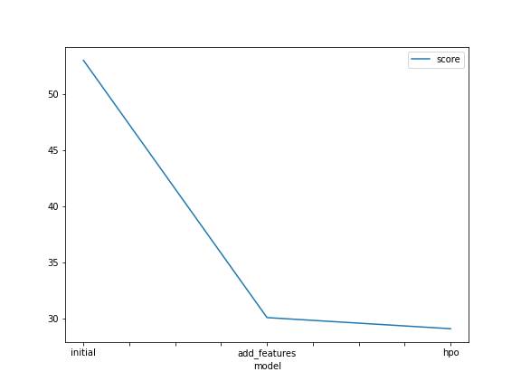
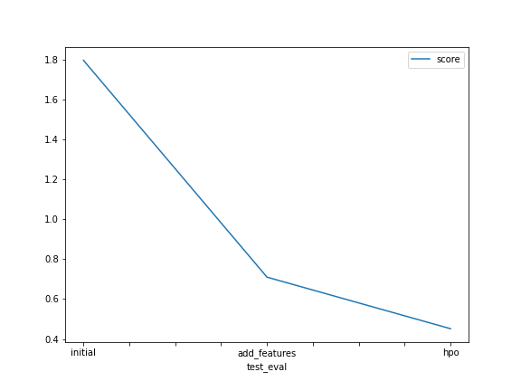

# Report: Predict Bike Sharing Demand with AutoGluon Solution
#### Mohamed Abed

## Initial Training
### What did you realize when you tried to submit your predictions? What changes were needed to the output of the predictor to submit your results?
I realized that some outputs had negative values in my submission file, so I needed to change all negative values to zero value for my submission to be accepted

### What was the top ranked model that performed?
WeightedEnsemble_L3

## Exploratory data analysis and feature creation
### What did the exploratory analysis find and how did you add additional features?
Using EDA I found some columns that needed change in data type such as 'datetime' to datetime type & 'season'/'weather' to category type.

Additional features were deducted from the datetime column, extracting an 'hour' column and adding it to our features

### How much better did your model preform after adding additional features and why do you think that is?
the rmse score was originally 52.98 which greatly improved to reach 30.104

## Hyper parameter tuning
### How much better did your model preform after trying different hyper parameters?
The rmse score improved slightly from 30.104 to 29.115

### If you were given more time with this dataset, where do you think you would spend more time?
I'd like to spend more time with the holidays/working days columns and see how they relate to our target

### Create a table with the models you ran, the hyperparameters modified, and the kaggle score.
|model       |hpo1             |hpo2                |hpo3               |score  |
|------------|-----------------|--------------------|-------------------|-------|
|initial     |num_bag_folds = 0|num_stack_levels = 0|auto_stack = False |1.45100|
|add_features|num_bag_folds = 6|num_stack_levels = 2|auto_stack = False	|0.67855|
|hpo         |num_bag_folds = 0|num_stack_levels = 0|auto_stack = True  |0.45152|

### Create a line plot showing the top model score for the three (or more) training runs during the project.

### Create a line plot showing the top kaggle score for the three (or more) prediction submissions during the project.

## Summary
When using autogluon tabular predictor on the bike sharing demand problem we managed to create a base model with a low accuracy score which was significantly better with additional important features and the right data types for our features.
As for using the autogluon hyperparameters, it only improved the accuracy slightly but it still proved the process of hypertuning our model to be imporatant 
